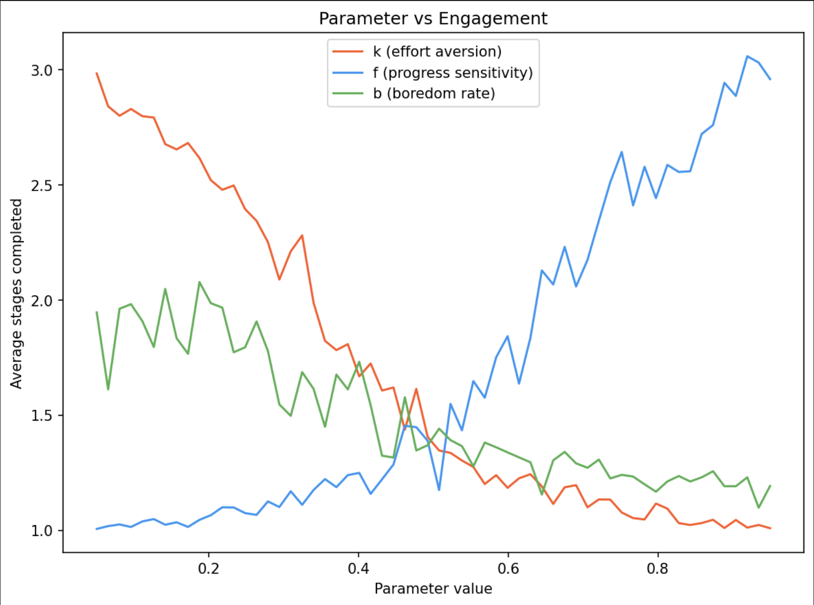

# V(0) Linear Function Approximate Model for Engagment

## Objective

The objective of this model is to infer latent motivational parameters from observed engagement behavior and use those estimates to adapt task parameters in order to maintain learner engagement. The guiding hypothesis is that engagement can be sustained by regulating reward prediction error (RPE) within a range that signals meaningful learning progress without excessive effort cost.

The model is structured as a generative behavioral model coupled with an online inference procedure.

---

## Generative Model

The system models a learner interacting with a staged task environment. At each stage the learner decides whether to continue or disengage. Decisions arise from latent motivational parameters that shape how learning signals and effort costs influence engagement.

The generative process is:

1. A learner with latent parameters interacts with the environment.
2. The learner experiences prediction errors during value learning.
3. Prediction errors influence a latent engagement signal.
4. The engagement signal determines the probability of continuing the task.
5. A stochastic decision generates the observed behavior.

Observed behavior consists only of binary continuation decisions at each stage.

---

## Model Structure

The system is divided into three components:

- environment
- agent
- inference

---

## Environment

The environment defines the staged learning task.

- Episodes consist of a fixed number of stages.
- Each stage has an associated difficulty level.
- Rewards occur at the final stage of an episode.
- Task difficulty influences both reward probability and effort cost.

State representation includes:

- stage index
- task difficulty
- normalized stage position

Reward at the final stage is determined by the learner's skill relative to task difficulty, with stochastic noise.

---

## Agent

The agent learns stage values and generates engagement behavior.

### Value Learning

Stage values are approximated using linear function approximation.

Value function:

V(s) = θ · φ(s)

Feature vector:

- bias term
- task difficulty
- normalized stage position

Weights are updated using the TD(0) update rule:

θ ← θ + α δ φ(s)

where

δ = r + γ V(s+1) − V(s)

The prediction error δ acts as a proxy for reward prediction error.

### Skill Dynamics

Skill represents the learner's competence at the task.

- Skill increases when positive prediction errors occur.
- Growth saturates as skill approaches a maximum.
- Skill influences reward probability and effort cost.

### Motivational Parameters

Each individual is characterized by three latent parameters.

- f : sensitivity to learning progress
- k : effort aversion
- b : boredom rate

These parameters determine how prediction errors and task costs influence engagement.

### Engagement Policy

At each stage an engagement signal is computed from prediction error and task costs.

signal = f * g(|δ|)

effort_cost = effort function(skill, difficulty, stage, k)

boredom_cost = boredom function(time_since_engagement, b)

engagement_score = signal − effort_cost − boredom_cost

Continuation probability is obtained through a logistic decision rule:

P(continue) = sigmoid(engagement_score)

Observed behavior is sampled from a Bernoulli distribution:

continue ~ Bernoulli(P(continue))

---

## Inference

Latent motivational parameters are inferred from observed behavior using sequential Bayesian inference.

### Particle Representation

The posterior distribution over parameters is approximated using a particle filter.

Each particle represents a candidate parameter set:

(f, k, b)

Particles maintain weights proportional to how well they explain observed engagement decisions.

### Likelihood

For each particle the model computes the probability of the observed engagement decision given its parameters.

P(behavior | parameters)

Weights are updated using Bayes' rule:

w_i ← w_i * likelihood_i

Weights are then normalized.

### Resampling

Effective sample size is monitored to detect particle degeneracy.

When particle diversity falls below a threshold:

- particles are resampled according to their weights
- small Gaussian noise is added to maintain exploration

---

## Validation

Parameter sweeps show:

- increasing effort aversion decreases stages completed
- increasing boredom rate decreases stages completed
- increasing sensitivity to learning progress increases stages completed
- 

---

## Planned Extensions

Several components remain to be implemented.

- a closed loop controller that modifies task parameters based on inferred motivational parameters
- a scheduling mechanism that detects convergence of the value function
- a policy for adapting difficulty, stage count, or pacing based on estimated parameters
- integration with real behavioral data rather than simulated agents

---

## Files

- temporal_difference_model.py
  Full implementation of the environment, agent, and particle filter inference system.
- engagement_by_params.png
  Visualization of parameter sweeps showing the relationship between motivational parameters and engagement behavior.

---

## Configuration

Task parameters can be modified through the following variables.

- stage_amt
  number of stages per episode
- diff
  baseline task difficulty
