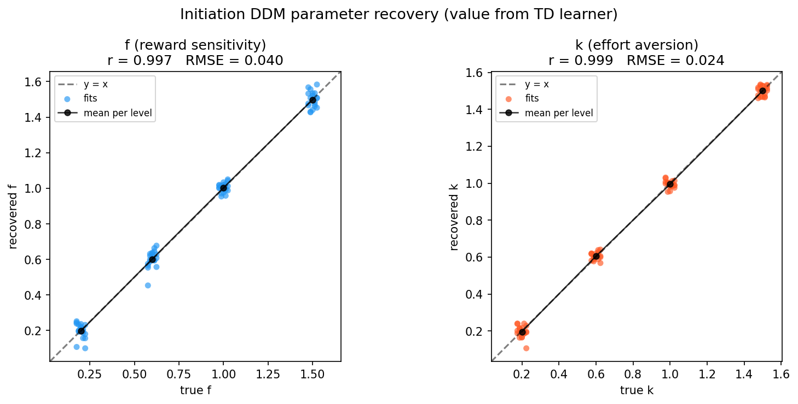

# Modelling why people start and don't

A computational model of task initiation. It observes a simulated learner and,
from choices and reaction times alone, recovers two parameters: how strongly the
learner is pulled by reward, and how strongly they are pushed away by effort.

The goal is to use these parameters to reshape the environment (difficulty,
pacing, how many steps it takes to resume) so that engaging becomes easier than
procrastinating.

This is an active research project. It runs on simulated agents only and has not
yet been fit to real human data.

---

## The equation

Every time a person finishes something, they face a small decision: start the
next thing, or do the cheap familiar thing instead. The model formalizes that
decision as

```
Drive = f · Value − k · EffortCost
```

- `f` is reward sensitivity: how strongly the expected payoff pulls the learner
  in.
- `Value` is what the learner currently believes the task is worth.
- `k` is effort aversion: how strongly cost pushes the learner away.
- `EffortCost` is how much work it takes to get started, in steps, clicks and
  navigation.

Two people facing an identical task can behave very differently. The model
attributes most of that difference to `f` and `k`.

Drive does not produce a decision instantly. It feeds a noisy accumulator (a
drift diffusion model) that races toward one of two boundaries, GO (start the
next episode) or STAY (repeat the cheap familiar action), and yields both a
choice and a reaction time. The reaction time is what makes the two parameters
separable: choices alone cannot distinguish a high `f` from a low `k`, but the
shape of the RT distribution can.

---

## The two halves of the project

### 1. Inference (implemented)

From behavior alone, recover `f` and `k` for a specific person. All work so far
has gone here, because control built on unreliable parameter estimates is worse
than no control.

### 2. Control (not implemented)

This is the objective of the project. Use the recovered parameters to adjust the
environment so the person continues engaging. The model already exposes the
control variables: `reentry_cost` (how many steps to resume), `diff` (task
difficulty), `stage_amt` (how far to the payoff).

---

## Model structure

Four layers: an environment, a learner, a decision rule, and an inference step
that inverts all three.

### 1. Environment

A staged task. Each episode has a fixed number of stages (`stage_amt`, default
4) at constant difficulty (`diff`). Reward arrives only at the final stage, as a
coin flip whose bias depends on how good the learner has become relative to how
hard the task is.

### 2. The learner

The learner maintains two quantities, kept separate by design.

Value, learned by TD(0) with linear function approximation:

```
V(s) = θ · φ(s)                    φ(s) = [1, difficulty, stage position]
δ    = r + γ·V(s+1) − V(s)         θ ← θ + α·δ·φ(s)
```

Competence, learned from practice rather than from prediction error:

```
P(success) = sigmoid(ability − DIFFICULTY_SCALE · diff)   ← Rasch / IRT
ability   += GAMMA on success, RHO on failure             ← Performance Factors
outcome    ~ Bernoulli(P(success))
```

Ability is on the logit scale and unbounded; success probability saturates
through the link function, so no explicit ceiling parameter is required.
`RHO > GAMMA`, since errors are more informative than successes.

Competence is kept off `δ` because these are different learning systems.
Prediction error is the teaching signal for value,
striatal); competence comes from repetition and error correction, on a
substantially separable substrate. Driving skill from `max(0, δ)` would halt
competence growth as soon as predictions become accurate, which is the wrong
direction: expertise continues to refine long after outcomes become predictable.
A pianist who can perfectly predict their own playing has not stopped improving.

The Bernoulli outcome also yields two properties without further assumptions.
First, variance is `p(1−p)`, so variability derivably falls as competence
grows rather than being stipulated by a separate noise function. Second, there
is no clipping artifact: the clipped-Gaussian reward it replaced placed 46% of
late draws at exactly 1.0, a point mass in what was meant to be continuous
noise.

### 3. The initiation decision

The decision node sits between episodes. The learner has just finished one; a
single accumulator decides whether to start the next.

- Value comes from `value_at_choice_point(state)` = `V(state, 0)`, what the
  learner expects from re-entering. The learner produces it; the caller never
  sets it.
- EffortCost is `state.reentry_cost`, set per scenario, not learned
  (`low = 0.3`, `high = 1.0`).
- Noise, boundary and deadline are pinned at `SIGMA = 0.7`, `BOUND = 1.5`,
  `T_DUR = 3.0` so they cannot absorb variance that belongs to `f` and `k`.

Every draw is logged to `state.initiation_passages`, including STAYs and
deadline timeouts. A STAY consumes one tick on the cheap repeat, produces no
learning, and increments `state.stuck`.

There is no within-episode continue/leave decision; the older one is retired. If
it is rebuilt it needs its own drift function, model instance and condition set,
kept separate from this one, otherwise a failed recovery run cannot identify
which node is responsible.

### 4. Inference

PyDDM's `Model.fit()` solves the Fokker-Planck equation for the first-passage
time distribution and fits `(f, k)`, bounded to `[0, 3]`, by differential
evolution over the logged decisions.

Censored trials are fed back in as undecided counts. This is consequential; see
"Censored trials are data" below.

---

## Running it

```bash
uv sync
```

```bash
# One learner: episodes gated by the initiation decision
python main.py
python main.py run --values 0.8,0.8

# Same, in the high re-entry cost scenario
python main.py run --values 0.8,0.8 --cost high

# Parameter recovery, value produced by the TD learner (the real test)
python main.py recovery --mode coupled

# Parameter recovery, value as a fixed design constant (the reference)
python main.py recovery --mode uncoupled
```

Bare `python main.py` is shorthand for `python main.py run`.

For `run`: `--values` takes two comma-separated floats for `(f, k)`, randomized
if omitted; `--cost` picks a `COST_PROFILES` entry (`low` = 0.3, `high` = 1.0);
`--decisions` caps how many initiation decisions to collect. For `recovery`:
`--mode` picks the pipeline and `--reps` sets repetitions per grid point.

---

## Files

| File | Purpose |
|---|---|
| `main.py` | The entry point. Single runs and recovery sweeps. |
| `config.py` | Hyperparameters, `UserParams` / `ModelState`, feature map, TD value. |
| `temporal_difference_model.py` | Agent, environment, episode loop, coupled trial driver. |
| `initiation.py` | The initiation DDM: drift, model, and one live re-entry draw. |
| `inference.py` | Sample construction, censored-trial handling, `fit`, sanity checks. |
| `recovery.py` | Designs, data generation, and both recovery pipelines. |
| `plots.py` | Recovery figures. |
| `NOTES.md` | Working notebook: intent, findings, open questions. |
| `assets/` | Generated figures. |
| `test.py` | Scratch pyddm example, not part of the model. |

---

## Current results

Both recovery runs sweep a 4×4 grid over `f, k ∈ {0.2, 0.6, 1.0, 1.5}` with 5
repetitions per point. Both enforce a 400-row floor and check that P(GO) rises
with value and falls with cost before fitting anything. If that monotonicity
fails, the drift is misspecified and no fit on that data is interpretable.

Uncoupled, with value as a fixed design constant
(`assets/initiation_recovery.png`):

| parameter | r | RMSE |
|---|---|---|
| f | 0.998 | 0.030 |
| k | 0.998 | 0.029 |

Coupled, with value produced by the TD learner
(`assets/initiation_recovery_coupled.png`):

| parameter | r | RMSE |
|---|---|---|
| f | 0.997 | 0.040 |
| k | 0.999 | 0.024 |



`k` is unchanged by the coupling. `f` degrades by about a third in RMSE. Once
value comes from the learner it is no longer under experimental control: at high
re-entry cost a learner with low `f` rarely produces a GO, so it completes few
episodes, `V` stalls near its starting value, and that cell contributes almost
no value contrast. `f` ends up identified mostly from the low-cost cell.

---

## Methodological notes

### Censored trials are data

PyDDM's likelihood is not renormalized over the decided region. Fit only the
trials that reached a boundary and the optimizer inflates drift at no likelihood
cost, shrinking the predicted undecided mass. At a true `(0.8, 0.8)` this
returned `(1.28, 1.27)`, a 60% overestimate on both, from a fit that was
otherwise well behaved. The correction is to feed the censored counts back in as
undecided trials. In general, under a response deadline the trials that produced
*no* response are data, and discarding them biases the estimates.

### The lockout state is a model prediction

At high re-entry cost a learner can record 0 GOs in 200 decisions. Never engages
→ never improves → `V` stays near zero → drift stays negative → still does not
engage. This initially appeared to be a modelling artifact, but it corresponds
to a documented phenomenon: the avoidance-maintained deficit cycle that
behavioral activation therapy targets in depression. What is unrealistic is that
the only escape route is DDM noise. Real people get prompts, deadlines, mood
swings, other people. The control half of the project is intended to fill that
gap.

### Recovery demonstrates identifiability, not accuracy

The generating model and the fitted model are identical here, so successful
recovery is expected. Real data is never generated by the fitted model. The
stronger test is misspecification recovery* generate from a richer process,
fit with this one, and measure the resulting bias. One such test has been run,
simulating with a realistic non-decision time and fitting with the current model
that assumes `T0 = 0`:

| true T0 | f error | k error |
|---|---|---|
| 0.2 s | −9.9% | −11.1% |
| 0.3 s | −11.3% | −12.9% |
| 0.5 s | −15.1% | −15.5% |

A single unmodeled parameter produces 11-13% bias at a realistic 300 ms, larger
than any bias the learning model contributes, and the correction is roughly one
line.

### Fixed parameters carry the identifiability

`SIGMA`, `BOUND` and `T_DUR` are held fixed precisely so they cannot absorb
variance belonging to `f` and `k`. Freeing them removes the identifiability.

### Value and cost must vary orthogonally

`f` and `k` are separable only because value and cost vary independently. In the
coupled setup this is fragile, because value comes from the learner and a
stalled learner stops producing variation in it.

---

## Known limitations

- `f` is confounded with the discount factor. `Drive = f · V(0)` and
  `V(0) ≈ γ³ · V(terminal)`, so switching which stage's value feeds the drift
  rescales recovered `f` by ~1.37 and changes nothing else. `f` is only
  identified up to `γ^(n−1)`. This is not resolvable from this data and should
  be stated whenever an `f` value is reported.
- No non-decision time. `T0` is fixed at 0. Real reaction times carry 200-500 ms
  of perceptual and motor latency, which biases `f` and `k` down by 11-13%.
- The value range is endogenous. A stalled learner stops generating value
  variation, so the coupled design has less leverage on `f`. Seeding learners
  partway up the learning curve would restore the contrast, but there is
  currently no way to start a `Simulation` mid-curve.
- Nothing in the model degrades. There is no fatigue, no forgetting, no
  accumulating cost of exertion. For a model of initiation that is a real gap,
  since the effort literature treats the rising cost of continued exertion as a
  core driver. The `b` (boredom rate) parameter in `UserParams` is inert, left
  over from the retired DDM, and is the natural place for it.
- Value is discretized. TD value is snapped to a 0.05 grid (`VALUE_STEP`) before
  being used as a DDM condition, to keep the number of Fokker-Planck solves per
  likelihood evaluation bounded.
- `T_DUR = 3.0` currently censors 30-45% of trials. Whether this is appropriate
  depends on whether the real task has a genuine deadline; see next steps.
- One decision node. Only the between-episode initiation decision exists.
- Simulated agents only. Never fit to real behavioral data.

---

## Next steps

### Near term: prepare the inference for real data

1. Free the non-decision time. It is currently fixed at zero. It is well
   identified from the leading edge of the RT distribution, and it is the
   largest measured bias in the model.
2. Check `T_DUR = 3.0` against the real task. If the task has a genuine 3-second
   deadline, the censoring is real data and the current handling is right. If it
   does not, `T_DUR` is an artifact discarding a third of the data and should
   sit past the longest observed RT. This is a design question, and it matters
   more than any parameterization choice.
3. Add across-trial drift variability (Ratcliff's `sv`). Without it a DDM cannot
   reproduce the observed relationship between correct and error RTs, and real
   data essentially always shows one.
4. Decide how `V` gets observed. This is the conceptual problem. In simulation
   `V` is known because it was generated; in a real person it is latent. The
   workable approach is fitting the TD model to their performance history and
   substituting `V̂`, but this is two-stage estimation: uncertainty in `V̂` does
   not propagate, so the `f` standard errors are too small. Joint estimation is
   correct and substantially harder.

### Next: individual-level estimation

5. Hierarchical estimation. Real studies give tens of decisions per person, not
   700. Partial pooling toward a group distribution is likely the largest
   available accuracy gain for individual `f`/`k`, plausibly the difference
   between usable and unusable estimates at realistic trial counts.
6. Posterior predictive checks. Does the fitted model reproduce the observed RT
   distributions and choice proportions? Held-out prediction as well. Recovery
   plots do not address this.
7. Seed learners across the learning curve. This addresses the value-contrast
   problem that costs `f` precision, and it is the appropriate way to model a
   participant who arrives with prior experience.

### Then: close the loop

8. Build the controller. Given `(f̂, k̂)`, select the environment settings that
   maximize sustained engagement, using `reentry_cost`, `diff` and `stage_amt`
   as control variables.
9. Target P(GO), not difficulty directly. The natural control objective is
   keeping drive in a band where engagement stays likely but the task is not
   trivial. `Drive = f·V − k·cost` is invertible: given `f̂` and `k̂` it solves
   for the `reentry_cost` that puts P(GO) at target.
10. Online re-estimation. Parameters drift within a session with fatigue, mood
    and boredom, so the controller must track them rather than fit once. A
    particle filter or a Kalman-style update is the appropriate mechanism.

### Deferred, but kept in view

- Rebuild the within-episode continue/leave node as a separate DDM, then run
  recovery on both nodes at once to confirm each stays identifiable.
- Fisher information analysis, to diagnose unidentifiable parameter combinations
  directly rather than inferring them from wide scatter.
- Two-state fast/slow ability (Smith, Ghazizadeh & Shadmehr 2006). It is more
  rigorous than the current single-rate model, and its identifying signatures
  (savings, spontaneous recovery) are well documented. But identifying them
  requires washout and re-exposure blocks, which a naturalistic study will not
  have, and adding parameters the design cannot estimate degrades prediction.
  Revisit only if the protocol gains those manipulations.
- Model a process that degrades: fatigue, forgetting, or the rising cost of
  continued exertion.

---

## Open question

Should `value_at_choice_point` be `V(0)` or `V(terminal)`? It is `V(0)` today,
because that is the state being entered. But the terminal bootstrap is
`V_next = 0`, which treats each episode as terminal, and now that an initiation
node decides re-entry, the task is a cycle. Under a continuing formulation the
bootstrap should be `γ · V(0)`, making `V(0)` the fixed point of a recurrence
that includes all future episodes. That would be a more accurate "value of going
back in", and it would widen the value range at no cost.
