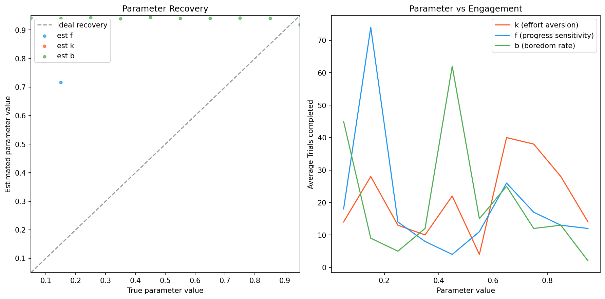

# TD(0) Reinforcement Learning with Bayesian Inference of Motivational Parameters

A computational model that infers latent motivational parameters from observed engagement behavior. The system combines temporal difference learning over a staged task with a drift diffusion model of disengagement, then uses a particle filter to recover the motivational parameters that generated the observed choices.

This is an active research project. Not all components are validated/implemented.

---

## Scientific Motivation

The guiding question is whether a small set of latent parameters can explain why a learner disengages from a task at a particular moment. The model treats each disengagement decision as a noisy sample from a generative process driven by three quantities:

- **f**, sensitivity to reward prediction error (progress signal)
- **k**, effort aversion (cost signal)
- **b**, boredom rate (time-dependent decay)

If these parameters can be recovered from behavior alone, the same framework can be inverted to adapt task difficulty in real time to keep a learner inside their productive range.

---

## Architecture

The model has three generative layers (environment, agent, engagement policy) plus an inference step that inverts them.

### 1. Environment

A staged task. Each episode has a fixed number of stages (`stage_amt`, default 4) with constant baseline difficulty (`diff`). Reward is delivered only at the terminal stage and depends on the learner's skill relative to task difficulty, with Gaussian noise scaled inversely by skill.

### 2. Agent

The agent learns stage values using TD(0) with linear function approximation.

```
V(s) = θ · φ(s)
φ(s) = [1, difficulty, normalized_stage_position]
δ = r + γ V(s+1) − V(s)
θ ← θ + α δ φ(s)
```

Skill grows with positive prediction errors and saturates as it approaches one.

### 3. Engagement policy (drift diffusion model)

At each stage, the probability of continuing versus disengaging is determined by a DDM whose parameters are functions of the latent motivational variables:

- **Drift rate**: `log1p(0.3 · t) − log1p(10 · f · δ)`. A time-dependent fatigue term pushes the accumulator toward disengagement, while the reward signal (scaled by f and the prediction error δ) pulls it back toward continuation. Higher f tilts drift toward continuation.
- **Noise**: fixed at 0.5.
- **Boundary**: `(1 − b) · 5`. Higher boredom rate shrinks the decision boundary, accelerating disengagement.
- **Starting position**: `k · stage_amt / 10`. Higher effort aversion starts the accumulator closer to the disengagement boundary.

The prediction error fed to the DDM is decayed across stages as `δ · exp(−0.3 · s)`, so later stages carry less of the reward signal. The DDM is solved per stage using `pyddm`, and the resulting probability of continuation is compared to a uniform draw to generate the observed binary decision.

### 4. Inference

Parameters are inferred using PyDDM's `Model.fit()`. It solves the Fokker-Planck equation for the first-passage-time distribution and fits (f, k, b) — bounded to [0, 1] — by differential evolution over the accumulated per-stage engagement samples.

---

## Files

| File | Purpose |
|---|---|
| `main.py` | CLI entry point: single runs, per-trial recovery plots, and the parallel parameter sweep. |
| `temporal_difference_model.py` | Agent, environment, training loop, and the `test_train` driver that fits parameters. |
| `ddm.py` | Drift diffusion model definition, per-stage solve, and PyDDM fitting. |
| `engagement_bayeserian.py` | Particle filter weight update and resampling (currently unused; see Known Limitations). |
| `config.py` | Hyperparameters, dataclasses (`UserParams`, `ModelState`), feature map, drift function. |
| `requirements.txt` | Python dependencies. |
| `assets/` | Generated figures. |

---

## Running

```bash
pip install -r requirements.txt
```

```bash
# Single run, print recovered parameters vs. ground truth
python main.py --function 1 --values 0.3,0.7,0.2

# Single run, plot estimated (f, k, b) across repeated fits
python main.py --function 2 --values 0.3,0.7,0.2

# Full parameter sweep with recovery and engagement plots
python main.py --function 3

# Run the sweep serially (default: all CPU cores)
python main.py --function 3 --workers 1
```

`--values` is three comma separated floats in [0, 1] corresponding to (f, k, b); if omitted, parameters are randomized. `--function 3` runs a full sweep and ignores `--values`. `--workers` controls how many processes the sweep uses (defaults to `os.cpu_count()`, `1` = serial).

---

## Validation

Parameter sweeps over each of f, k, and b (holding the others at 0.5) reproduce the predicted directional effects:

- Increasing f increases the number of stages completed before disengagement.
- Increasing k decreases stages completed.
- Increasing b decreases stages completed.



Parameter recovery is currently noisy. The DDM has known identifiability issues: drift, boundary, and starting position interact to produce relatively flat likelihood surfaces, so distinct parameter combinations can generate near-identical engagement distributions. This is the active problem.

---

## Known Limitations

- **Identifiability.** The current parametrization of the DDM does not uniquely determine (f, k, b) from engagement-duration data alone. Fisher information diagnostics on the recovered posterior are the next planned step.
- **Per-stage DDM solve.** Each stage triggers a full numerical solve of the diffusion process, which dominates runtime. A closed-form first-passage time approximation would be substantially faster.
- **Simulated agents only.** The model has not been fit to real behavioral data.

---

## Planned Extensions

- Fisher information matrix analysis to diagnose unidentifiable parameter combinations and inform reparametrization.
- A closed-loop controller that uses the inferred (f, k, b) to adapt stage count, difficulty, or pacing.
- Fitting to real engagement data once a behavioral dataset is in place.
- Particle Filter not currently in use. Will be repurposed to find temporal difference parameters to estimate delta values the DDM depends on from real data.
