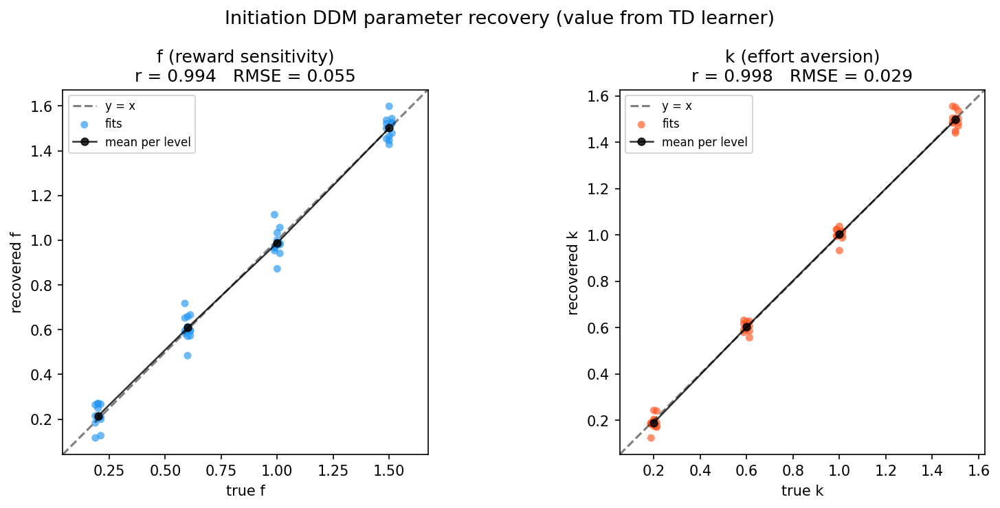

# Modeling motivation through ordinary task behavior

A computational model of task initiation. From choices, reaction times and how long
someone works on a question before giving up, it recovers how strongly a person is
pulled by reward, how strongly they are pushed away by effort, and how they react to
the set they just played.

The goal is to use these parameters to reshape the environment (how hard the
questions are for this person, how often mistakes come back, whether right/wrong
is shown, whether questions they gave up on come back) so that engaging becomes
easier than stopping.

This is an active research project. It runs on simulated people, and on human
sessions played in `interface.py` that are recorded across sessions. No estimate
from a real person has been validated yet.

---

## Main equation

Every time a person finishes a set, they face a small decision: start the next
one, or stop. The model formalizes that decision as

```
Drive = f · Value − k · EffortCost
Value = V(0) + Σ δ the last set's prediction error, carried
```

- `f` is reward sensitivity: how strongly the expected payoff pulls the learner in.
- `Value` is what the learner believes the next set is worth, `V(0)`, plus how the
  set just played came out against what was predicted of it.
- `k` is effort aversion: how strongly cost pushes the learner away.
- `EffortCost` is how much it takes to get going again.

The drift has only these two parameters. What the last set did to this person has no
term of its own. It is prediction error, which reaches the accumulator through `Value`
and is scaled by the same `f` as everything else. When you see that you got a question
wrong, that slot paid nothing against a value that expected something, which is a
negative `δ`. A miss you are not shown cannot produce one. "Feedback is timing, not
reward" covers what this gains and what it gives up.

Drive does not produce a decision instantly. It feeds a noisy accumulator (a drift
diffusion model) that races toward one of two boundaries, GO (start the next set)
or STAY (stop), and yields both a choice and a reaction time. The reaction time is
what makes the parameters separable: choices alone cannot distinguish a high `f`
from a low `k`, but the shape of the RT distribution can.

### Giving up on a question

A person can skip a question, but only after trying it; there is no separate
"answer it or skip it" choice. While they work, the same drive runs the other way:

```
quit drift = k · cost − f · value
value = ACHIEVEMENT_SCALE · p(1 − p) / stage_amt + δ  what getting it right would add,
                                                      plus the error at the slot just left
cost  = REPEAT_COST_SCALE · min(1/p, 8)               the effort it takes
```

with `p` their chance on that question. It feeds a one-boundary accumulator (same
`SIGMA` and `BOUND`); if it reaches the bound before they reach an answer, they give
up. The time to give up then has a closed form, the inverse Gaussian (Wald)
distribution (`persistence.py`). Giving up is a skip, or leaving if they close the app
on that question.

- **Patience is per person.** Model time becomes seconds through `patience`, the
  seconds per unit of model time; someone who skips at a glance has a small one. It
  was a fixed 10 s at first. The first real player's skips took 1.5 to 4.2 s, which at
  10 s are 1-in-10,000 to 1-in-10,000,000 events. Their fitted patience is 2.8 s
  (−log L 38, against 55 at 10 s).
- **Answered questions count too.** An answer after 25 s says "kept going at least
  25 s", so it enters the likelihood through the survival function, as a right-censored
  time to give up. Every question is an observation, skipped or not.
- **2% of questions are lapses**: given up on, or kept at, for reasons the model does
  not describe, at a uniform time within 60 s. One odd skip (79 + 85, an
  83% chance for that player, dropped after 2.2 s) then cannot decide the estimate
  on its own.
- **Leaving from the first question after coming back** is giving up on it too. In
  the simulator, giving up on the first question of a set started cold abandons the
  set, and the next start decision is cold again.
- **A skip is neither right nor wrong**, so it does not move the ratings.
- **The last question carries into this one.** `δ` is the prediction error from the
  slot just left: seeing that you missed the last one makes giving up on this one more
  likely, and seeing that you got a hard one right makes it less. With feedback hidden
  there is no error to carry, so `δ` is 0 and only `p` matters.
- **It is used for patience only.** `f` and `k` come from decisions; answer and skip
  times add nothing to them (see "Skips do not help estimate `f` and `k`" under
  Current results).

---

## 1. Inference

From behavior alone, recover `f` and `k` for a specific person (`inference.fit`).

## 2. Control (`controller.py`)

This is what the project is for: using the recovered parameters to adjust the
environment so the person keeps engaging and keeps being challenged.

Every few sets the controller re-fits the person's `f` and `k` (shrunk toward a prior
while data is thin) and their patience from time on questions. It then copies the
person exactly as they are (measured ability, how hard each question type is for them,
what they still owe, their current value) and simulates 84 candidate settings forward
with the *estimated* parameters:

- a **target chance of getting a question right**, 90% down to 20%;
- a **review rate**: how an unanswered question comes back;
- **feedback shown or hidden**;
- **whether questions they skipped come back** through review, or are dropped. With
  review at 0 nothing comes back.

Rollouts include giving up on questions, driven by the same estimated `f` and `k` and
the person's estimated patience, so a hard target is worth less for someone who would
skip most of it.

It screens all 84 with short rollouts (4 × 80 decisions), re-tests the best four and
the current setting with long rollouts on fresh seeds (16 × 300), and switches to the
one earning the most **total reward** only if that re-test beats the current setting
by more than twice its standard error. Short rollouts alone were too noisy to act on.
For a simulated person put off by misses they see, hiding feedback earns about 40×
the reward (measured at `T_DUR = 3.0`), yet 4 × 80 measured the gain at +21 ± 12 and
the controller kept feedback on. Even given that person's true parameters, it finished
one run at 52 reward, against 210 for the best fixed setting. With the re-test it hides
feedback from its first plan: 89 reward over 200 decisions, against 2.6 at the default.

Over 84 settings, on an idle machine at `T_DUR = 7.0` with about 150 decisions of
history, a plan takes 21 to 27 s when the parameters are known and 60 to 250 s when it re-fits:
the fit dominates and grows with data. The interface runs it in a separate process, so
play continues meanwhile.

About 15% of updates pick a setting at random instead. Those probes are independent of
the person, and when the best setting keeps feedback on they are the only source of
sets with it hidden, so they are what gets both ways of timing a set's reward into
the same record.

Total reward is right answers weighted by how hard each was
for the person, `1 − p`, summed over the sets they go on to play. Three other
objectives were measured and rejected: episodes completed and questions answered
right both always pick the easiest setting for everyone; challenge attempted
(`1 − p` over every question, right or wrong) kept rising all the way to a 20%
target for some people, which pushes them to miss four in five. Total reward peaked
mid-range for all five simulated people checked, and where it peaked differed by
person (400 decisions, 4 seeds, `T_DUR = 3.0`):

| person | peak target | total reward at 90% / 60% / 45% / 30% / 20% |
|---|---|---|
| f 0.8, k 0.8 | 45% | 22 / 62 / **88** / 69 / 46 |
| f 1.2, k 0.4 | 30% | 42 / 89 / 113 / **138** / 123 |
| f 0.6, k 1.2 | 45% | 9 / 14 / **16** / 10 / 7 |
| f 0.4, k 0.4 | 45% | 28 / 65 / **94** / 77 / 52 |
| f 1.0, k 1.0 | 45% | 21 / 53 / **77** / 62 / 34 |

That is why the target range reaches down to 20%: a person whose best setting is
low should not be stuck at the edge of what the controller may choose.

Two settings are not levers. `reentry_cost` is left out because cheaper re-entry
always wins, and setting it from the person's state couples cost to value, which earlier
collapsed the `k` estimate to zero. Showing the stage count or the score is left out
because nothing in the model represents them.

**Decision rule for this table, fixed on 2026-09-13 before the 8-seed run.**
- A claim that the controller beats the fixed default, or beats random switching, for a
  person needs the mean over seeds of the paired difference to exceed twice its standard
  error. Paired means the same seed: the same simulated person and question
  difficulties. The controller applies this margin to itself before switching.
- A difference inside that margin is reported as undetermined, in either direction.
- Every cell reports the mean ± standard error over seeds.
- The best fixed setting is chosen on 8 seeds and scored on 8 others, so picking and
  scoring on the same runs does not flatter it.

**Does it help?** *Measured under the reaction-term drift, retired on 2026-09-21 (see
"Feedback is timing, not reward"). Two of the five people are defined by `b_seen` /
`b_unseen`, which no longer exist, so those rows cannot be reproduced at all and the
other three were measured with a `value` that did not yet carry prediction error.
The table is kept for the method rather than the numbers, and the run has not been
repeated.*

Five simulated people, measured the way the interface measures a
human: question types are rated by Elo from their answers, and the controller never
sees the truth. They can give up on questions (patience 10 s) and leave from the first
question after coming back. 300 start decisions, 8 seeds, `T_DUR = 7.0`. The run was held
to the terminal bootstrap so that step 3 (see "Value bootstrap") compares like with like.
Total reward, mean ± standard error over seeds:

| person | fixed default | random switching | controller | controller given true parameters | best fixed setting* |
|---|---|---|---|---|---|
| f 0.8, k 0.8 | 54.6 ± 2.5 | 58.8 ± 6.6 | **148.8 ± 19.3** | 140.9 ± 20.0 | 181.2 ± 13.5 |
| f 1.2, k 0.4 | 68.3 ± 5.1 | 83.9 ± 4.5 | **188.2 ± 27.8** | 194.1 ± 29.8 | 251.2 ± 5.0 |
| f 0.6, k 1.2 | 16.3 ± 4.4 | 18.0 ± 5.7 | **38.2 ± 11.8** | 39.1 ± 9.7 | 37.9 ± 11.7 |
| f 0.8, k 0.8, put off by misses they see (`b_seen` −1.0, `b_unseen` +0.8) | 8.4 ± 1.4 | 24.7 ± 9.1 | **37.5 ± 16.2** | 195.9 ± 17.4 | 237.6 ± 33.7 |
| f 0.8, k 0.8, spurred on by misses they see (`b_seen` +0.8, `b_unseen` −1.0) | 63.4 ± 4.7 | 26.1 ± 8.2 | **179.2 ± 23.3** | 170.5 ± 29.8 | 237.6 ± 33.7 |

\* The best of the 84 settings held fixed, picked on 8 other seeds and scored on these.
For every person it is review 0 with skipped questions dropped, and a 45% or 60% target.
The last two rows share a best-fixed-setting score because the two people with reactions
are mirror images: feedback off for one plays out exactly like feedback on for the
other, on every seed.

The fixed default is a 75% target, review 0.25, feedback on, skipped questions dropped.
This table is not comparable with the 2-seed table it replaces, which used
`T_DUR = 3.0` and picked the best setting on the seeds it was scored on.

Verdicts under the rule (paired difference over the 8 seeds; a win or loss only beyond 2 SE):

| person | controller − fixed default | controller − random switching | controller − controller given true parameters |
|---|---|---|---|
| f 0.8, k 0.8 | +94.3 ± 19.3, **win** | +90.1 ± 22.2, **win** | +7.9 ± 10.6, undetermined |
| f 1.2, k 0.4 | +119.9 ± 27.7, **win** | +104.2 ± 28.4, **win** | −5.9 ± 5.8, undetermined |
| f 0.6, k 1.2 | +21.8 ± 12.3, undetermined | +20.2 ± 12.5, undetermined | −0.9 ± 14.7, undetermined |
| put off by visible misses | +29.1 ± 14.9, undetermined | +12.7 ± 20.8, undetermined | −158.4 ± 22.8, **loss** |
| spurred on by visible misses | +115.8 ± 25.8, **win** | +153.1 ± 25.9, **win** | +8.7 ± 10.1, undetermined |

- **It beats the fixed default and random switching for three of five people**, by +90
  to +153 reward. For the reluctant, effort-averse person (f 0.6, k 1.2) and the person
  put off by visible misses, the point estimates are positive but inside the margin,
  so the result is undetermined. The earlier 2-seed claims, "four of five" against the default
  and "three of five" against random switching (with two losses), do not survive.
- **Estimating the person costs nothing detectable for four of five.** Against the same
  controller given true parameters, every difference is within 2 SE, except for the
  put-off person. There it loses 158 ± 23: the cold-start problem, since nothing reveals
  that reaction without first showing them misses. With the fit it hides feedback on
  14% ± 6% of decisions; given true parameters, 76% ± 7%.
- **Given true parameters it does not reach the best fixed setting for two people**:
  −40.3 ± 17.9 for f 0.8, k 0.8 and −57.1 ± 27.0 for f 1.2, k 0.4, about 77% of the best.
  The other three are undetermined, with ratios of 72 to 103% and wide intervals. The
  earlier "84 to 99% of the best fixed setting" is withdrawn; it came from 2 seeds, scored
  where the best setting was picked.
- **Skipping was described, not tested.** People skipped 1.3% ± 0.1% of questions
  (f 1.2, k 0.4) to 14.0% ± 4.3% (f 0.6, k 1.2) under the fitted controller,
  4.0% ± 1.6% to 17.8% ± 8.1% under random switching, and under 1.5% at the fixed
  default. Skip shares were not compared under the rule, so the earlier "skips are rare
  under the controller" is not a claim.
- **The skipped-questions lever is still unproven.** No person's best fixed setting
  brings anything back (review 0 for all five), so this run says nothing about when
  returning skipped questions helps.
- **Exploration probes.** A quarter of controller runs, for both versions, ended on a
  random probe. Whether probes cost reward was not tested, so the earlier claim that they
  do is withdrawn.

---

## Model structure

Four layers: an environment, a learner, a decision rule, and an inference step that
inverts all three.

### 1. Environment

A staged task. Each set is `stage_amt` slots (default 4), one question in each.

**Question types, rated per person** (`questions.py`). Questions come in types, each
with a rough prior difficulty in logits:

| type | example | prior |
|---|---|---|
| add, 1-digit | 7 + 5 | −2.0 |
| add, 2-digit | 47 + 38 | −0.5 |
| subtract, 2-digit | 83 − 47 | 0.0 |
| times tables | 8 × 7 | 0.0 |
| multiply, 2-digit × 1-digit | 64 × 7 | 1.0 |
| subtract, 3-digit | 702 − 358 | 1.0 |
| divide, 3-digit ÷ 1-digit | 952 ÷ 7 | 2.0 |
| multiply, 2-digit × 2-digit | 47 × 38 | 2.5 |
| multiply, 3-digit × 2-digit | 347 × 58 | 3.5 |

The prior is only a starting guess. After every answer an Elo-style update re-rates
both the person and that type,

```
p = sigmoid(ability − difficulty[type])
ability         += K_a · (correct − p)
difficulty[type] −= K_d · (correct − p)        steps shrink as answers accumulate
```

so a type's rating ends up describing how hard it is *for this person*. Each slot
then serves a type whose predicted chance is nearest the current **target chance**
(types within 0.1 of the best match are all eligible, so near-equivalent types all
get rated). Hard is relative to the person by construction. On a simulated person
perfect at addition and ~75% at 2-digit × 1-digit multiplication, 60 answers at a
75% target were enough to stop serving addition entirely; 11 of the last 20
questions were 2-digit × 1-digit multiplication.

**Only a question's first showing rates it.** A review or redo of the same question is
not a fresh sample of its type. Before this rule, a single question (34 × 8, shown 8
times) was all the evidence behind one player's 23% chance on every 2-digit × 1-digit
multiplication.

**Typos are not misses** (interface). A miss put right on the redo within 2 s
(`SLIP_SECONDS`) is treated as a slip: the ratings are restored to before the miss and
the question is rated as answered right, it is not owed, and it does not count as a
miss. The first player's log had six wrong-then-right redos;
two were fixed in under a second (11 + 20 → 21, then 31 in 0.4 s).

The recovery pipelines in `main.py` still use the older single-`diff` task (with
optional per-stage `diff_spread`); question types are used by `controller.py`'s
simulated people and by `interface.py`.

**What a set is worth.** The reward at the end of a set is its right answers, each
weighted by how hard it was, times a scale:

```
reward = ACHIEVEMENT_SCALE · Σ_right (1 − p) / stage_amt        ACHIEVEMENT_SCALE = 4
```

A trivial right answer earns almost nothing, so a set of easy wins is worth little
and a learner can stop out of boredom. Under the previous reward (fraction right)
the model could not represent that: it believed the easiest setting was always the
most rewarding, which is why a human player given only single-digit questions was
never offered anything harder. Sets played in 400 decisions, `f = k = 0.8`, 4 seeds, `T_DUR = 3.0`:

| reward | target 90% | 75% | 60% | 45% |
|---|---|---|---|---|
| fraction right (old) | **120** | 97 | 66 | 41 |
| hard right answers, scale 1 | 24 | 24 | 24 | 24 |
| hard right answers, scale 4 | 46 | 60 | 86 | **106** |

The scale is a calibration. The expected reward per question,
`p(1 − p)`, peaks at 0.25; scale 4 makes that peak 1.0, the value of a perfect set
under the old reward, so `f` keeps its earlier meaning. Unscaled, value sat about 4×
below cost and every simulated person gave up whatever the difficulty. Since drive
is `f · Value`, the scale and `f` are interchangeable: changing one is equivalent to
rescaling the other.

The effort a set costs is its review load (the share of slots spent
going back over mistakes), and it raises the cost of the next start decision.

A slot normally holds a new question. It can instead revisit one missed
earlier, displacing the new question: sets never get longer, so review trades
against coverage. Who decides that is `review_mode`, described under the learner.

When right/wrong is hidden for a set, there is also no redo prompt: it
would only ever appear after a miss, so offering it would reveal the miss. Owed
questions still come back through review.

A skipped question spends its slot and earns nothing. It is held apart
from the questions missed: whether skipped questions join what review brings back is
a setting (`return_skipped`, a controller lever). One that comes back and is answered
right counts as a correction; answered wrong, it is owed like any miss; skipped
again, it stays skipped.

**Questions that come back** (interface). A question is never shown twice in one set,
except as a redo the person chose. One that comes back and is missed or skipped 3 times
(`RETIRE_AFTER`; redos do not count) is retired: it stops coming back, and a `retired`
event is logged. Before this, one player was shown 853 − 163 twice in a row and skipped
it both times in 1.5 s. The simulator's owed items are question types rather than
individual questions, so neither rule applies there.

When the learner is the one deciding redos (`review_mode = "choice"`), effort
aversion produces a spiral nothing stipulates: high `k` declines the redos, so less
is learned, so fewer questions are answered right, so `V` stays low, so
re-engagement drops. At `k = 1.2` that is 32 sets in 800 decisions, against 55 when
review is scheduled (measured under the fraction-right reward, `T_DUR = 3.0`).

### 2. The learner

The learner maintains two quantities, kept separate by design.

Value, learned by TD(0) with linear function approximation:

```
V(s) = θ · φ(s)                    φ(s) = [1, stage position]
δ    = r + γ·V(s+1) − V(s)         θ ← θ + α·δ·φ(s)
```

At a set's last slot, `V(s+1)` is `V(0)`, the start of the next set: the continuing
bootstrap (see "Value bootstrap").

**A slot's reward arrives when the person is shown it.** With feedback on, a question's
worth lands at that slot: `(1 − p)` if they got it right, nothing if they did not.
With feedback off nothing lands until the end-of-set score, which pays the whole set at
once. A set totals the same either way: feedback moves *when* the signal arrives, not
how much (`config.slot_reward`). That timing is the whole of feedback's effect on
motivation, and it is what the three reaction terms used to stand in for.

With feedback hidden this is exactly the old schedule, one lump of
`ACHIEVEMENT_SCALE · achievement / stage_amt` at the last slot, so the only change is
that showing an outcome moves its reward forward to the slot it happened at.

`φ` used to carry `difficulty` as a second feature. It was doing no work: `diff`
never varies during learning, so `θ[1]` collapsed to exactly `θ[0]·d`, perfectly
collinear with the intercept, and contributed ~1% of `V(0)`.

Competence, in the simulator, is learned only from correcting what was missed:

```
P(success) = sigmoid(ability − difficulty)       ← Rasch / IRT
outcome    ~ Bernoulli(P(success))               ← per question
ability   += CORRECTION_GAIN   only when a question answered wrong (or skipped)
                               earlier is shown again and answered right
```

A first-time correct answer teaches nothing, and neither does a failure; only a
correction does (`config.update_ability`, `config.settle_skipped`). This is deliberate practice rather than
error correction: working a question out between sessions, without being shown it
again, teaches nothing here.

**Measured versus simulated competence.** For a real person there is nothing to
simulate: `interface.py` *measures* competence with the Elo ratings above, and the
controller's rollouts start from that measurement. The corrected-question rule is
how a simulated person's true ability changes; the ratings are what the environment
can know about it. The controller only ever sees the ratings, never a simulated
person's truth.

**Who decides whether a missed question comes back** is `review_mode` on
`Simulation`, not the learner in general:

| mode | who decides | learning gated by |
|---|---|---|
| `scheduled` (default) | the controller, at `review_rate` per slot | the schedule |
| `choice` | the learner, offered a redo after each miss | `k` |
| `quiet` | nobody; missed questions never return | nothing is learned |

That choice is what keeps `k` a motivational parameter. When the learner decides,
`k` sets the learning rate as well as the willingness to start, and effort cost and
skill can no longer be manipulated separately. Measured at `f = 0.8`, 800 decisions,
5 seeds, under the fraction-right reward, `T_DUR = 3.0`:

| k | scheduled: sets / ability / P(succ) | choice: sets / ability / P(succ) |
|---|---|---|
| 0.2 | 486 / 5.29 / 0.992 | 431 / 3.40 / 0.948 |
| 0.8 | 247 / 4.66 / 0.984 | 140 / 1.66 / 0.754 |
| 1.2 | 55 / 2.55 / 0.826 | 32 / 0.68 / 0.545 |

Competence is kept off `δ` because these are different learning systems. Prediction
error is the teaching signal for value; competence comes from repetition and error
correction, a largely separate learning system. Driving skill from `max(0, δ)`
would halt competence growth as soon as predictions become accurate, which is the
wrong direction: expertise continues to refine long after outcomes become
predictable.

### 3. Decision nodes

The two choices, starting the next set and redoing a miss, use the **same
accumulator** (same drift form, noise, bound and deadline) fed different conditions.
They are two observations of the same person, and their draws stack into one fit.
`GO = 1` means "took the effortful option" in both.

**The initiation node** sits between sets and decides whether to start the next one.

- Value is `V(state, 0)` plus the last set's total prediction error, `Σ δ`, clipped to
  `±DELTA_CLIP` so the condition grid stays bounded. The error is carried at full
  weight; there is no fitted carry coefficient.
- EffortCost is `structural(in_session) + EFFORT_WEIGHT · last_episode_effort`:
  `WARM_COST` (0.05) while in a session, `state.reentry_cost` (the cold-start
  profile: `low` 0.3, `mid` 0.6, `high` 1.0) after leaving, plus review load.
- Noise, boundary and deadline are pinned at `SIGMA = 0.7`, `BOUND = 1.5`,
  `T_DUR = 7.0` so they cannot absorb variance that belongs to the parameters. The
  deadline was 3.0 s until 2026-09-13; see "The deadline was discarding human choices".

**The repeat-or-continue node** fires after a missed new question, when the learner
decides redos and feedback is shown. It fires *after* the miss has landed as reward,
not before: they see how the question went, that produces the error, and then they
decide whether to take it again. Value is the slot's share of the terminal reward,
discounted by slots to come, plus that error, so missing an easy question, which is
the bigger surprise, discourages the redo more than missing a hard one. Cost is how
hard the missed question is for them, the expected attempts `1/P(success)` capped at 8,
so what it carries is `k`.

**The persistence node** runs on every question while it is being worked on (see
"Giving up on a question"). It shares `f` and `k` with the other two but is a
one-boundary process with no deadline. Seconds become model time through the person's
`patience` (default 10 s), estimated per person. Simulated people also need a time
to solve each question; it is lognormal with a median of `4 s / p^0.7`: about 4 s for
a sure thing and 20 s at a 10% chance, close to the 1 to 30 s one human took in
`data/`. Real people simply take the time they take.

### 4. Inference

PyDDM's `Model.fit()` solves the Fokker-Planck equation for the first-passage time
distribution and fits by differential evolution: `(f, k)`, bounded to `[0, 3]`. Those two
are the whole model. What the last set did to the person is already inside `value`, so
it needs no parameters of its own and is not fitted separately.

Answer and skip times have a closed-form likelihood (`persistence.neg_log_likelihood`,
per second, with lapses). The controller uses it only for patience
(`persistence.fit_patience`, with `f` and `k` held at the decisions' estimate). Passing
it to `fit` as `attempts` adds it to pyddm's likelihood through a custom loss, fitting
decisions and persistence as one set of parameters. That joint fit is kept for
comparison and is not used for planning.

A decision that reached no boundary by `T_DUR` is an undecided trial. That includes
a *person* who took longer than 7 s to click, since pyddm refuses outright to fit an
RT past the model's deadline. Undecided trials are fed back in as counts, not
discarded; see "Censored trials are data".

---

## Human sessions (`interface.py`)

You answer the questions, choose whether to redo one you got wrong, and choose
whether to start the next set. There is no countdown: both prompts wait for you, and
the time to click is the reaction time. **"I'm done" closes the app** and is logged
as the stop decision. Closing the window without choosing is logged as an abandon.

**Skip** (the button under the answer box, or Esc) gives up on the question on
screen. It is logged with how long you worked on it and your predicted chance on it,
and the set moves on to the next slot. Whether skipped questions come back is the
"skipped questions come back too" checkbox, or the controller's call.

**Leaving is recorded with what was on screen.** Closing the window, Ctrl-C in the
terminal, closing the terminal, or `kill` all log an `abandon` with the screen you were
on. On a question it also records the question, your chance on it, how long you had
it, and whether it was the first question since opening the app. Looking at a question
and leaving is giving up on it, so it joins the persistence data. An exit nothing sees
(a crash, power loss) is found on the next launch and logged as `unlogged`, with the
question that was on screen and no time.

**Old saves are brought up to the current rules.** The first-showing, typo and
retirement rules apply to the whole record, not only to new answers. A state saved
under older rules gets its ratings and failed-return counts rebuilt from
`decisions.jsonl` on the next launch, logged as `rebuilt`, and questions that have
already failed 3 returns are retired. The record itself is never rewritten. On the
first player's data:
- their chance on 2-digit × 1-digit multiplication went from 37% to 55%, now rated on
  1 answer instead of the 8 showings of 34 × 8;
- measured ability went from 1.26 to 1.47;
- 853 − 163 was retired.

Replaying a record written under the current rules reproduces the ratings kept live
exactly, so the rebuild is the same rule applied after the fact, not an approximation.

`RULES` went to 3 on 2026-09-21, when the reaction terms were removed. That one is not
replayable: a start decision logged under rules 1 and 2 holds a `value` that predates the
prediction-error carry, so its `value` is right for the drift it was drawn under and
not comparable with a later row. The rows are kept and still fit, since the drift form
`f · value − k · cost` is unchanged, but they under-represent how much value varies.

**Everything persists** in `data/` (gitignored):

- `decisions.jsonl`: the record, append-only and synced to disk before the app moves
  on: every start and redo decision, every answer and skip (question, type, your
  answer, your predicted chance, time on it), exits with what was on screen, retired
  questions, set starts and ends, controller decisions, launches.
- `state.json`: the snapshot to pick up from: value weights, ratings, owed and
  skipped questions with their exact text, how often each came back and failed,
  settings, and what is on screen right now. Written atomically, so a crash never leaves half a
  file.
- `controller.pkl`: the controller, including its estimates.

Reopening the app logs a `return` with the time since you left, and every fit and
plan uses every session. "Export all decisions to csv" writes `data/decisions.csv`.

Tick **"controller sets target, review, feedback, skipped"** and it plans in a separate
process every 5 sets and moves the settings panel itself, with a line saying why. With
it off, the target chance, review rate and the feedback and skipped checkboxes are
yours. Feedback changes apply from the next set.

Three properties of human data follow from this flow, and all three matter for inference:

- **Every stop is a session end.** Each session contributes at most one "no" at the
  start prompt, and those are what identify `k` there. Many sessions are needed. In
  practice people stop by closing the app: the first player's four sessions ended with
  one "I'm done", two window closes, and one exit nothing logged. Those exits are why
  leaving is now recorded with what was on screen.
- **The fit never sees a cold start from a human.** Opening the app is the cold
  decision, and its "reaction time" is hours. Every start decision the fit sees is
  made mid-session, at warm cost. For humans, most of what identifies `k` comes from
  the redo prompts, whose cost does vary with how hard the missed question is, and
  now also from time spent on questions.
- **Every question is a persistence observation.** A set gives one start decision but
  four or more questions, each with a time and whether it was skipped. Earlier
  sessions' answers are used too: they were logged with a time and a predicted
  chance, so they enter as questions nobody gave up on.

A redo in the interface is an extra question rather than the next slot, so a human
set can run past `stage_amt` questions and its review load can exceed 1; in the
simulator's `choice` mode a redo takes the next slot.

### On a website (`web.py`)

`python web.py` serves the same task in a browser at `http://127.0.0.1:8000`. The
browser only draws screens and times them; every rule is `interface.App`'s, run on the
server by a subclass that sends its screens to the page instead of Tk. Nothing about
the task, the record or the inference is re-implemented.

**Data collection is off until it is approved.** Research with other people needs
approval first, so by default (`TEMPORAL_COLLECT=0`) nobody else's data is kept:

- The start screen shows the consent information
  (a **draft**, in `web/index.html`, to be replaced with the approved wording), and
  offers two ways in: **as a guest** or **with an email**.
- **Guests are never saved.** Their record lives in a temporary folder that is deleted
  when they leave the page.
- **Email** is accepted only for the addresses in `TEMPORAL_RESEARCHERS`
  (comma-separated): the researchers, playing themselves. Their records are kept in
  `$TEMPORAL_DATA/<email>/` (default `data/web/<email>/`), with the same
  `decisions.jsonl` / `state.json` / `controller.pkl` as `data/`, and they see
  "dev stuff".
- With `TEMPORAL_COLLECT=1` anyone may take part with an email after ticking the
  consent box. The first event of each session is a `consent` record with the email,
  whether they agreed, and `CONSENT_VERSION` (in `web.py`; bump it whenever the consent
  text changes).

The email is not verified: anyone who types an address plays as that person. That
is enough to keep one person's sessions together, but it is not a login.

- **Reaction times are measured in the browser**, from the moment a screen is painted
  to the key press or click, so network latency never enters an RT. The 600 ms
  "correct" / "wrong" flash plays in the browser before the next screen, and its clock
  starts after the flash.
- **Starting from the start screen is launching the app**, so each start is a new
  session. Closing the tab, reloading or navigating away is closing the window: it is
  logged as an `abandon` with what was on screen and the browser's time on it. Starting
  again elsewhere (another tab or device, same email) closes the first one the same way.
  A page left silent for 2 hours is closed as well. A server that dies without closing
  is caught on the next launch, as `unlogged`, the same as a crash on the desktop.
- **Plans and fits run in one process pool** shared by all players.
- **Dev stuff** (settings, behind the scenes, fit, export) is shown to researchers
  only, or to everyone with `TEMPORAL_PANEL=1`.

Run it as **one worker process**: live sessions are held in memory.

**Hosting on Fly.io** (`fly.toml` is in the repo):

```bash
brew install flyctl && fly auth login
fly launch --copy-config --no-deploy        # pick an app name and region
fly volumes create temporal_data --size 1   # where records live; without it, a redeploy wipes them
fly secrets set TEMPORAL_RESEARCHERS=you@example.com
fly deploy
fly scale count 1                           # exactly one machine: sessions are in memory
fly ssh sftp get /data -r ./data-from-fly   # download the records
```

Anywhere else, build the `Dockerfile`, mount a persistent volume at `/data`, and
set the same environment variables. It listens on `$PORT` (default 8000).

---

## Running it

```bash
uv sync
```

```bash
# Play it yourself. Data is kept in data/ between sessions.
python interface.py

# The same task in a browser, at http://127.0.0.1:8000. Only researchers' data is kept,
# in data/web/<email>/, until TEMPORAL_COLLECT=1.
TEMPORAL_RESEARCHERS=you@example.com python web.py

# One simulated person: a fixed setting vs the controller
python controller.py --values 0.8,0.8

# One simulated learner on the single-diff task
python main.py run --values 0.8,0.8

# Parameter recovery from ONE learner (the default)
python main.py recovery --mode single

# Parameter recovery from two learners pooled at different cold-start costs
python main.py recovery --mode coupled

# Parameter recovery, value as a fixed design constant (the reference)
python main.py recovery --mode uncoupled

# f and k from decisions, from answer and skip times, and from both
python main.py recovery --mode persistence

# patience, estimated the way the controller does
python main.py recovery --mode patience
```

Bare `python main.py` is shorthand for `python main.py run`.

For `run`: `--values` takes `f,k`; `--cost` picks the cold-start profile; `--review-mode`
and `--review-rate` set review; `--diff-spread` sets per-stage difficulty spread;
`--decisions` caps the number of start decisions. For `recovery`: `--mode` picks the
pipeline and `--reps` sets repetitions per grid point. For `controller.py`:
`--values`, `--decisions`, `--seed`.

---

## Files

| File | Purpose |
|---|---|
| `main.py` | Entry point for single runs and recovery sweeps. |
| `config.py` | Hyperparameters, `UserParams` / `ModelState`, value, competence, cost. |
| `questions.py` | Question types, their priors, and per-person Elo ratings. |
| `temporal_difference_model.py` | The simulated learner: sets, review, reward, the start decision. |
| `initiation.py` | The accumulator: the drift, the model, one live draw. |
| `persistence.py` | Giving up on a question: quit drift, per-person patience, closed-form likelihood with censored answers and lapses, simulated solve and quit times. |
| `inference.py` | Sample construction, censoring, the two-parameter `fit`, optionally joint with persistence, sanity checks. |
| `recovery.py` | Data generation and recovery pipelines, including persistence and patience. |
| `controller.py` | Re-fits the person, simulates candidate settings from their current state, switches to the one earning the most reward. |
| `interface.py` | Human-playable version: no countdown, stop closes the app, persistent record. |
| `web.py`, `web/index.html` | The same app served to a browser: start screen, consent, guest or email, one record per email. |
| `Dockerfile`, `fly.toml` | Hosting `web.py`; data in a volume at `/data`. |
| `plots.py` | Recovery figures. |
| `data/` | Human session record (created by `interface.py`, gitignored). |
| `assets/` | Generated figures. |

---

## Current results

All `f, k` recovery runs sweep a 4×4 grid over `f, k ∈ {0.2, 0.6, 1.0, 1.5}`, enforce a
400-row floor, and check that P(GO) rises with value and falls with cost before
fitting anything.

**Most results here predate the current drift.** Every result in this section predates 2026-09-21, when the three reaction
terms were removed and what a set does to the next decision became prediction error
inside `value` (see "Feedback is timing, not reward"). On the single-`diff` task the
learner saturates, so `δ` is small there and the recovery numbers move little; where
they have been re-measured the table says so. Anything quoting a `b` term is retired.

**Most were also measured at the old deadline and bootstrap.** Every result in this
section was measured at `T_DUR = 3.0` with the terminal value bootstrap unless it says
otherwise. The deadline moved to 7.0 s on 2026-09-13 (see "The deadline was discarding
human choices"). That changes simulated people too: fewer draws time out. Results
re-measured at 7.0 s say so.

| pipeline | f: r | f: RMSE | k: r | k: RMSE |
|---|---|---|---|---|
| **single**, one learner (3 reps) | 0.986 | 0.088 | 0.997 | 0.036 |
| **coupled**, two stacked learners (3 reps) | 0.994 | 0.055 | 0.998 | 0.029 |
| **uncoupled**, value as a design constant (5 reps) | 0.998 | 0.030 | 0.998 | 0.029 |



**Single-learner pass condition: `f` RMSE near 0.035 is retired (2026-09-13).** That
figure belongs to a design where the experimenter sets value and cost orthogonally; the
uncoupled pipeline reaches 0.030 that way. A single learner generates its own value and
cost, correlated with each other and confined to what the learner happens to experience.
Recording the same person at four points on the learning curve was meant to close the
gap. It got to 0.049, not 0.035, and barely widened value (standard deviation 0.222
against 0.230 for one continuous learner). The numbers are in the table below.

Single-learner recovery: 1200 recorded decisions per fit, 4×4 grid × 3 reps, `T_DUR = 7.0`,
with 95% bootstrap intervals over the 48 fits.

| pipeline | f RMSE | k RMSE | value sd |
|---|---|---|---|
| one learner, terminal bootstrap | 0.079 [0.059, 0.098] | 0.029 [0.024, 0.033] | 0.115 |
| one learner, continuing bootstrap | 0.054 [0.042, 0.064] | 0.033 [0.027, 0.037] | 0.222 |
| four learners across the learning curve, continuing | 0.049 [0.036, 0.061] | 0.041 [0.034, 0.049] | 0.230 |

Paired by grid point and rep:
- **Reseeding does nothing detectable for `f`.** Against one continuous learner, both
  continuing: `f` −0.005 [−0.015, +0.006]. It probably makes `k` slightly worse: +0.009
  [0.000, +0.018].
- **The continuing bootstrap is a real gain.** Against the terminal one, for one learner:
  `f` −0.026 [−0.045, −0.006], because value varies about twice as much.
- **Errors concentrate at `f = 1.5`.** Per-grid-point `f` RMSE there is 0.03 to 0.11 even
  with reseeding.

**Replacement, fixed before its test reps were run.** The design:
- one simulated person, mid cold-start cost, scheduled review;
- continuing bootstrap, `T_DUR = 7.0`;
- 1200 recorded decisions, split across four learners after 0, 200, 500 and 1000
  discarded warm-up decisions;
- the 4×4 grid, two-parameter fit.

It passes if, on 3 fresh reps per grid point (seeds not used when this was written),
**`f` RMSE ≤ 0.05 and `k` RMSE ≤ 0.05**. The 0.05 comes from the controller, which rounds
`f` and `k` to steps of 0.05 before planning (`snap_value`), so an estimate off by about
one step plans like the truth or its neighbour. The `k` bound stops `f` being bought
with `k`.

**Verdict: the original condition (`f` RMSE near 0.035) is not met and is retired; the
replacement is met.** On the 48 fresh fits (reps 3 to 5): **`f` RMSE 0.045 [0.037, 0.053]**
and **`k` RMSE 0.042 [0.030, 0.057]**, both under 0.05.
- **The margin is thin.** The upper ends of both 95% intervals are above 0.05, so any
  change that could move either by 0.01 should be re-checked against this condition,
  not assumed to still pass.
- **The worst grid points are effort-averse people who rarely start.** `f` RMSE is
  0.065 at (f 0.2, k 1.5) and 0.061 at (0.6, 1.5).

**The hard-right-answers reward helped `k` and cost `f`**, against the fraction-right
reward on the same grid and reps:

| pipeline | f RMSE before → after | k RMSE before → after |
|---|---|---|
| single | 0.058 → **0.088** | 0.059 → **0.036** |
| coupled | 0.049 → 0.055 | 0.032 → **0.029** |

The uncoupled pipeline has no learner and is unaffected. The single-learner loss in
`f` is the one to watch. Why it happens has not been isolated; the likeliest candidate
is that on the single-`diff` task a learner who masters the fixed difficulty now finds
each right answer worth less, so value drifts down late in a run and spans a narrower
range, and `f` is identified from variation in value. This has not been measured.

**The single-run pipeline is the point of the cost restructure.** Before it, a run
charged one constant cost for every decision, so `k` could not be recovered from one
participant at all: `k̂` sat at 0.42 to 0.55 against a truth of 0.80 regardless of how
much data accumulated, and `collect_coupled` had to pool two simulations at different
costs to manufacture the contrast. Endogenous contrast is still weaker than a designed
one: use `single` when modelling one real participant, `coupled` when you control the
design.

**Refactoring left the earlier model untouched.** With the old fraction-right reward,
the same learner, settings and seeds reproduced the pre-change result exactly (246.8
sets per learner, identical per seed). This no longer holds as of 2026-09-21: reward
now lands slot by slot when it is shown, so the TD trajectory differs even under the
fraction-right reward.

**Feedback is timing, not reward (2026-09-21).** The three reaction terms
`b_seen · seen_miss + b_unseen · unseen_miss + b_fb · feedback` were removed from the
drift. They existed to patch a hole in the learner: mid-set outcomes produced no
prediction error at all, because every slot but the last paid zero reward, so getting a
question wrong and being shown it moved `δ` by exactly nothing, and feedback never
entered the TD system anywhere. The three terms were reading, off to the side, what the
value system should have been computing.

They are replaced by the mechanism they stood in for. A slot's worth lands when the
person is shown it; with feedback hidden it lands at the end-of-set score instead, and a set totals the
same either way. A seen miss is then a slot that paid nothing against a value that
expected something, which is a negative `δ`, and an unseen miss cannot produce one. That
error is carried into the next decision through `value`, at full weight, scaled by the
same `f` as everything else. That removes three fitted parameters and adds none.

**It improves recovery, because value now varies more.** `f` is identified from
variation in value, and prediction error is most of that variation. Same pipelines,
same grid, same 1200 decisions per fit, `T_DUR = 7.0`, continuing bootstrap:

| pipeline | f RMSE before → after | k RMSE before → after | value sd before → after |
|---|---|---|---|
| single-`diff`, one learner (4×4 × 3 reps) | 0.054 → **0.038** | 0.033 → 0.034 | 0.222 → **0.287** |

Unpaired: the two runs do not share seeds, and the old figure's fresh-reps interval was
0.045 [0.037, 0.053], so read this as "no worse, probably somewhat better", not as a
measured 0.016 gain. The single-`diff` task is the weak test: a learner there masters
the fixed difficulty, so `p → 1`, achievement per question → 0, and `δ` shrinks with it.

On the question-type task, where the target holds `p` away from 1 and `δ` stays alive,
`δ` supplies about 80% of the standard deviation of value. Eight fits, 700 decisions
each, four `(f, k)` pairs × 2 seeds, settings switched by random probes:

| | f | k |
|---|---|---|
| RMSE | 0.049 | 0.027 |

with value sd 0.35 to 0.41 and `corr(value, cost)` −0.22 to −0.50. The correlation is
higher than before and recovery is better anyway; see "Value and cost must vary
orthogonally".

**The feedback decision is now derived rather than fitted, and it depends on
difficulty.** The old `b_fb` was additive and constant, so it could not interact with
how hard the questions were. Under pure RPE it must: showing an outcome delivers its
`(1 − p)` early, discounted less, but it also delivers the misses now instead of burying
them in the terminal lump. One person (`f` 0.8, `k` 0.8), planned from an unsaturated
measured state, 96 paired seeds × 300 decisions, review 0.25:

| target chance right | feedback on | feedback off | paired difference |
|---|---|---|---|
| 90% | 45.8 | 44.0 | **+1.75 ± 0.52** (+3.4 SE), feedback on |
| 30% | 63.4 | 64.2 | −0.79 ± 1.16 (−0.7 SE), undetermined |

- **Showing feedback to someone who is mostly right is a win** under the same 2-SE rule
  the controller applies to itself.
- **The sign flip is suggested, not established.** At a 30% target the point estimate
  favors hiding it, and at 32 seeds over 200 decisions it reached −3.90 ± 2.19 (−1.8 SE),
  but neither clears the margin. The prediction that feedback should be hidden from
  someone who is missing most of it is the next thing to test properly, with more seeds
  at the low targets.
- **Boredom is now a state the model can express.** It is sustained `|δ| ≈ 0`: a trained
  person on an easy question has `(1 − p) → 0`, so being shown they were right confirms
  an expectation and pays nothing. Feedback holds attention only when the outcome was
  uncertain, which is why the target and the feedback switch interact.

**What it gives up** is a person *spurred on* by a visible miss. `b_seen > 0` was the only
way to express that sign; under pure RPE a seen miss is negative for everyone, in
proportion to their `f`. The two simulated people in the controller table above were
built on exactly that contrast and can no longer be constructed.

**The old reaction-term recovery, retired.** It worked, on data no real session
resembles: on a balanced design (every miss × feedback × cost combination equally
often) 288 decisions recovered the signs at about a quarter of the true sizes and 720
recovered all five. Measured like a human (one person, Elo-rated question types,
settings switched at random every 25 decisions, four people × 3 reps, 1200 decisions),
RMSE was `f` 0.083, `k` 0.048, `b_seen` 0.077, `b_unseen` 0.060, `b_fb` 0.033, with
every one of the 36 reaction estimates carrying the right sign and the no-reaction
person coming back within ±0.07 of zero on all three. Accuracy was never the
problem; the terms had no mechanism behind them.

**Skips do not help estimate `f` and `k`.** Twelve simulated people (4 profiles × 3
reps) who can give up on questions, 300 start decisions each (human-sized data),
settings switched at random (`python main.py recovery --mode persistence`):

| fitted from | f RMSE | k RMSE |
|---|---|---|
| decisions only | **0.049** (was 0.380) | **0.099** (was 0.160) |
| answer and skip times only | 0.517 (was 1.238) | 0.396 (was 0.475) |
| both, jointly | 0.066 (was 0.376) | 0.123 (was 0.165) |

The "was" column is the same test under the five-parameter fit, run before patience and
lapses existed, at a fixed 10 s, and with one of the four people defined by reaction
terms. It is not a clean paired comparison, but **`f` RMSE on human-sized data fell from 0.380
to 0.049**, and nothing about the grid or the lapse mixture accounts for a factor of
eight. Thin data is where dropping three parameters pays: 300 decisions could not place
five, and places two well.

The conclusion the table was built for is unchanged. Adding answer and skip times to the
decisions still makes `f` worse (0.049 → 0.066), and on their own they still cannot
place it. A question's value, `p(1 − p)`, hardly varies across questions, while its
cost, `1/p`, varies about 4×, so skip times mostly measure `k`, and the redo prompts already carry
that. On the first real player the joint fit was harmful: their fast skips moved `f`
from 3.0 to 0.0. So the controller fits `f` and `k` from decisions, and uses time on
questions only for patience.

**Patience can be recovered, and errors in `f` do not spoil it.** Twelve simulated people
(4 profiles × 3 reps), 300 start decisions each, settings switched at random. `f` and `k`
were fitted from decisions; patience was then fitted from time on questions, once with
the fitted `f` and `k` and once with the true ones (`python main.py recovery --mode
patience`):

| true patience | fitted, range over 3 reps | give-ups per person |
|---|---|---|
| 2 s | 2.5 to 2.8 s | 24 to 42 |
| 5 s | 3.8 to 5.4 s | 26 to 66 |
| 10 s | 9.1 to 16.4 s | 7 to 54 |
| 20 s | 14.9 to 24.9 s | 2 to 15, and one person with none |

Across the 11 people who gave up at least once, patience was typically off by a factor
of 1.30 with fitted `f` and `k`, against 1.26 with the true ones. The `f` estimates were
poor at this data size (0.34 and 1.42 for a true 0.8), yet patience barely moved, and
someone who gives up at a glance (2 s) was never mistaken for a patient person (10 s).

With no give-ups, patience is not identified: the fit ran to its 60 s bound (including
that person, the factor is 1.50). The controller does not fit it in that case and keeps
the 10 s default.

**The repeat-or-continue node barely improves identification**, contrary to the
reason it looked attractive (measured under the earlier design, where it fired on
every failure). Stacking its draws onto the start decisions, 30 fits per row:

| `diff` | redo draws | f start only | f stacked | k start only | k stacked |
|---|---|---|---|---|---|
| 0.1 | 39 | 0.051 | 0.052 | 0.109 | 0.108 |
| 0.5 | 91 | 0.096 | 0.095 | 0.048 | 0.044 |

It earns its place as a behavioral mechanism, and for human data it matters more than
this suggests: humans never produce a cold-start decision the fit can use, so the redo
prompt's varying cost carries much of the information about `k`.

---

## Methodological notes

### Censored trials are data

PyDDM's likelihood is not renormalized over the decided region. Fit only the trials
that reached a boundary and the optimizer inflates drift at no likelihood cost,
shrinking the predicted undecided mass. At a true `(0.8, 0.8)` this returned
`(1.28, 1.27)`, a 60% overestimate on both. The correction is to feed the censored
counts back in as undecided trials.

### Every model here carries a 2% lapse mixture

pyddm's `gddm` mixes a lapse into every model by default (`mixture_coef = 0.02`): 2% of
trials are drawn from a uniform distribution over the whole deadline instead of from the
accumulator. It is left at its default, and it matters in three ways.

- **Simulation and fitting stay consistent.** The same mixture is in the draws the
  simulator takes and in the likelihood the fit maximizes, so recovery is unaffected.
- **It explains RTs faster than the non-decision time.** A model with `T0 = 0.3` still
  produces a few decisions under 0.3 s; they come from the mixture, not the accumulator.
- **It floors the likelihood.** No observed RT has zero density, so a single odd human
  decision cannot make a parameter set impossible. That is the same job the explicit
  lapse term does for giving up on questions (`persistence.LAPSE`), which had to be
  written by hand because that likelihood is ours rather than pyddm's.

### The countdown invented decisions

An earlier interface put a 3-second countdown on both prompts and re-offered the start
prompt after every timeout. One human session logged 20 consecutive timeouts: rows in which
the person decided nothing, each entered as a censored decision. The countdown is
gone; a slow human choice is kept with its real RT and counted as undecided only at fit
time, against the model's deadline.

### The deadline was discarding human choices

Audited on 2026-09-13 with `python main.py audit`: the first player's 26 start and redo
decisions, against the deadline of the time, 3.0 s.

| decisions | n | median | 90th percentile | longest | past 3.0 s |
|---|---|---|---|---|---|
| start | 12 | 1.02 s | 5.52 s | 6.07 s | 3 (25%) |
| redo | 14 | 0.94 s | 1.69 s | 2.99 s | 0 |
| all | 26 | 0.98 s | 3.82 s | 6.07 s | **3 (11.5%)** |

11.5% is far past a 2% tolerance, so `T_DUR` moved to 7.0 s, past the longest RT; none
of the 26 is past it now. All three slow decisions (4.64, 5.61 and 6.07 s) were choices
to start the next set, and two came right after a set in which the player skipped three
questions. Three decisions are too few to call that a pattern, but they are exactly the
hesitations a model of reluctance should see, and the fit had been recoding each one as
"no decision".

Refitting the same decisions, all five parameters. *The five-parameter fit was retired
on 2026-09-21; under the current two-parameter model the same 26 rows give `f` 2.77,
`k` 0.82, `T0` 0.00, with `f` still at the edge of its bound, which is what 26 rows buys.
The point below about three recoded choices stands regardless of the drift.*

| deadline | decided / undecided | f | k | b_seen | b_unseen | b_fb |
|---|---|---|---|---|---|---|
| 3.0 s | 23 / 3 | 2.34 | 0.69 | +0.26 | +0.19 | +0.20 |
| 7.0 s | 26 / 0 | 1.76 | 0.49 | +0.30 | +0.95 | +0.18 |

- **Three decisions moved `f` by 25% and `k` by 29%.** Neither fit is trustworthy at 26
  decisions; the point is how far three recoded choices moved them.
- **`b_unseen` was unconstrained.** This player has never had a set with feedback
  hidden, so the jump from +0.19 to +0.95 meant nothing. That failure mode is gone with
  the terms: feedback now has no parameter of its own to leave unidentified.
- **The longer deadline costs compute.** A solve takes about 2 ms instead of 1, and a five-parameter fit on this data
  took 38 s instead of 17. The two-parameter fit is far cheaper again.
- **Simulated people change too.** The deadline is part of the model, so a draw that used
  to time out between 3 and 7 s now reaches a decision. At `f = k = 0.8`, with the
  terminal bootstrap, a simulated person now plays 141 sets in 400 start decisions,
  against 51 at 3.0 s. Someone bored by easy wins plays 109 sets at a 90% target and 170
  at 60%, against 49 and 74. With the continuing bootstrap as well (the default since the
  same day), those become 243, 195 and 250: the boredom effect shrinks from 36% fewer
  sets at a 90% target to 22%. The old accuracy-reward model still reproduces its 246.8 sets when pinned back to 3.0 s, so
  nothing else moved. Tables in this README measured at 3.0 s are marked as such.

### The lockout state is a model prediction

At high re-entry cost a learner can record 0 GOs in 200 decisions. Never engages →
never improves → `V` stays near zero → drift stays negative → still does not engage.
This matches the avoidance-maintained deficit cycle that behavioral activation therapy
targets in depression. Review mode decides what an escape
is worth: under `quiet` an escapee learns nothing, under `choice` a high-`k` escapee
declines the redos and learns little, under `scheduled` escapes compound.

### Recovery demonstrates identifiability, not accuracy

The generating model and the fitted model are identical here, so successful recovery is
expected. Real data is never generated by the fitted model.

**Non-decision time is the one misspecification measured** (`python main.py recovery
--mode t0`). One learner per run, 1200 decisions, 3 reps per value, `T_DUR = 7.0`,
continuing bootstrap, true `f = k = 0.8`. Each dataset is fitted twice: with `T0` pinned
at 0, as the model did until 2026-09-15, and with `T0` free.

| true T0 | f pinned | k pinned | f free | k free | T0 recovered |
|---|---|---|---|---|---|
| 0.0 s | 0.82 | 0.80 | 0.83 | 0.81 | 0.03 |
| 0.2 s | 0.74 | 0.74 | 0.80 | 0.80 | 0.23 |
| 0.3 s | 0.73 | 0.72 | 0.82 | 0.80 | 0.31 |
| 0.5 s | 0.69 | 0.68 | 0.82 | 0.80 | 0.48 |

- **Pinning it costs 8 to 15% on both parameters**, and the bias grows with the true value.
- **Freeing it removes the bias.** `f` lands within 0.03 of the truth and `k` within
  0.01, at every value, and `T0` itself within 0.03.
- **It costs almost nothing when there is none.** With a true 0 the free fit returns 0.03
  and the parameters barely move.
- **It is now free where real people are fitted**: the controller's estimate and the
  interface's "fit my parameters". The recovery pipelines still pin it, so their numbers
  stay comparable with the ones above them.
- **An earlier version of this test** (at `T_DUR = 3.0`, terminal bootstrap, pinned fits
  only) reported −9.9% to −15.5%. These numbers supersede it.

### Fixed parameters carry the identifiability

`SIGMA`, `BOUND` and `T_DUR` are held fixed precisely so they cannot absorb variance
belonging to the parameters. Freeing them removes the identifiability.

### Value and cost must vary orthogonally

`f` and `k` are separable only because value and cost vary independently. Collinearity
depends on the magnitude of their correlation, not its sign: `+0.90` once collapsed the
`k` estimate to zero, and `−0.89` appeared at `(f, k) = (1.5, 1.0)` under scheduled
review, where recovery still held. It is the number to re-check after any change to
cost or to value.

Carrying prediction error into value (2026-09-21) raised the correlation and improved
recovery anyway, because it added far more variance to value than it did shared
variance with cost. On the question-type task at a held target, 400 decisions:

| | corr(V(0), cost) | corr(δ, cost) | corr(value, cost) | sd of value |
|---|---|---|---|---|
| feedback on | −0.16 | −0.14 | −0.24 | 0.178 → 0.228 |
| feedback off | −0.30 | −0.23 | −0.40 | 0.156 → 0.223 |

Both channels correlate with cost for the same reason: cost rises with review load,
review brings back questions the person already missed, and those earn less than
expected. The correlation is a property of the task, not of the carry.

---

## Known limitations

- `f` is confounded with the discount factor. Under the continuing bootstrap
  `V(0) ≈ γ^(n−1)·E[r] / (1 − γ^n)`, so `f` is only identified up to that factor, and,
  since `ACHIEVEMENT_SCALE` multiplies value, up to that scale too. State `γ`, the scale
  and the bootstrap whenever an `f` value is reported; an `f` fitted under the terminal
  bootstrap is not on the same scale.
- The non-decision time is bounded to [0, 0.5] s when fitted. Below that bound only the
  2% lapse mixture gives a fast decision any density, so a person whose non-decision time
  exceeds their own fastest decision cannot be fitted, and the bound has to move with the
  data. The first player's 26 decisions put `T0` at 0.00 with a fastest decision of
  0.51 s, which cannot be told apart from a small positive value.
- The deadline is set from one person's decisions. `T_DUR = 7.0` sits past the longest
  RT seen so far (6.07 s); anyone slower is censored again. `python main.py audit`
  flags a share past the deadline above 2%.
- The value range is endogenous. A stalled learner stops generating value variation,
  so there is less leverage on `f`; the worst recovery checked sat at high `k`.
- Effort cost is weak and retrospective: review load moves cost by about 0.02. Nearly
  all cost variation in simulation comes from sessions going cold and warm, which
  human data never shows the fit (see Human sessions).
- A type's rating only moves when that type is served. Types far from every target the
  person ever gets keep their prior indefinitely.
- The model cannot represent someone *spurred on* by a visible miss. Under pure RPE a
  miss they see is a negative error for everyone, scaled by their own `f`; only a free
  `b_seen > 0` could give it the other sign, and that is what was removed. If a real
  person turns out to work that way it has to re-enter as a cost effect, not a value one.
- `f` now carries two jobs: how much the expected payoff pulls, and how hard the last
  set's surprise hits. The old `b` terms let those differ per person; folding them into
  value asserts they are one sensitivity. That is a substantive claim about
  people rather than a simplification, and it has not been tested against a human.
- The prediction error is clipped at `±DELTA_CLIP` (1.0) so `value` stays on a bounded
  grid. It binds on about 0.5% of decisions with feedback hidden and never with it on.
- Learning still saturates at a fixed difficulty, and under `choice` and `quiet` the
  missed list grows without bound; nothing forgets.
- Value and cost are discretized (`VALUE_STEP`, `COST_STEP`) to keep the number of
  Fokker-Planck solves bounded.
- Both nodes share one accumulator and one set of parameters. That is an assumption:
  a real task might give the redo choice a different deadline.
- Patience is estimated with `f` and `k` held at the decisions' estimate, so their
  errors pass into it, and it absorbs anything about giving up that the drift does not
  describe. A skip at a glance and giving up after a long try are one process on a
  different time scale here, not two processes.
- Retiring questions, never repeating one within a set, and treating a quick fix as a
  typo are interface rules with no simulator counterpart. `RETIRE_AFTER = 3` and
  `SLIP_SECONDS = 2` are judgment calls: the first player got 34 × 8 right on its 8th
  showing, which retirement would now prevent.
- Treating an answer as a censored time to give up assumes how long a question takes
  to solve does not depend on motivation. Someone who rushes when they want to stop
  breaks that.
- Time on a question includes anything else they did meanwhile. Walking away mid-question
  reads as long persistence.
- Simulated solve times are an assumption (median `4 s / p^0.7`, lognormal), checked only
  against one person's 30 answers.

---

## Next steps

### Near term: prepare the inference for real data

1. Done on 2026-09-15: the non-decision time is fitted rather than assumed away, for the
   controller's estimate and the interface's fit (see "Recovery demonstrates
   identifiability"). What is left is to watch it per person as sessions accumulate, and
   to move the [0, 0.5] s bound if anyone's fastest decision falls near it.
2. Keep the deadline past human decision times: run `python main.py audit` after each
   batch of sessions. Done once, on 2026-09-13, which moved it from 3.0 to 7.0 s.
3. Add across-trial drift variability (Ratcliff's `sv`).
4. Value for a real person has an observable proxy. Under the continuing bootstrap it
   is `V(0) ≈ γ^(n−1) · E[set reward] / (1 − γ^n)`, and set reward is computable from
   the measured chance of each question, so no TD fit is needed. Confirm it tracks
   during learning, not only at the fixed point.

### Next: individual-level estimation

5. Hierarchical estimation. Real sessions give tens of decisions per person. Partial
   pooling toward a group distribution is likely the largest available accuracy gain.
6. Posterior predictive checks and held-out prediction on recorded sessions.
7. Seed learners across the learning curve.

### Then: close the loop

8. Improve the controller. On 8 seeds it beats the fixed default and random switching
   for three of five simulated people; for the other two the result is undetermined.
   Given true parameters it falls detectably short of the best fixed setting for two
   people under the terminal bootstrap and three under the continuing one. What remains:
   - **The reluctant, effort-averse person.** They play only 16 to 47 sets in 300 decisions,
     so the controller's advantage for them is undetermined. Candidates: a stronger prior,
     or no switching until the fit settles.
   - **Establish the feedback sign flip.** Showing feedback wins at a 90% target by
     +3.4 SE; hiding it at a 30% target is the right sign at −0.7 SE. More seeds at the
     low targets would settle whether the controller should ever hide it.
   - **Exploration that hurts.** A random probe can land on the one setting that drives
     a person away. Probe near the current setting, or less often once estimates settle.
   - **The gap to the best fixed setting**, about 72 to 95% given true parameters. It is not
     the value bootstrap, which step 3 ruled out. Untested causes: the 300-decision
     confirmation horizon, planning every 25 decisions, and the exploration probes a
     quarter of runs end on.
   - **The skipped-questions lever is unproven.** No simulated person's best setting
     brings anything back, so nothing here shows when returning skipped questions helps.
     A person whose ability grows from corrections would be the test.
   - `stage_amt` is not a lever yet, and show count / show score have no model channel.

9. Online re-estimation. Parameters drift within a session with fatigue, mood and
   boredom, so the controller must track them rather than fit once.

### Deferred, but kept in view

- Fisher information analysis, to diagnose unidentifiable parameter combinations
  directly rather than inferring them from wide scatter.
- Two-state fast/slow ability (Smith, Ghazizadeh & Shadmehr 2006), if the protocol ever
  gains washout and re-exposure blocks.
- Model a process that degrades: fatigue, forgetting, or the rising cost of continued
  exertion.

---

## Value bootstrap: continuing since 2026-09-13

This was the open question: is a set its own episode, or is the task a cycle? The start
decision re-enters the task, so it is a cycle. A set's last slot now bootstraps from the
start of the next set, `δ = r + γ·V(0) − V(last)`, which makes `V(0)` the fixed point of a
recurrence over all future sets (`config.CONTINUING = True`). The old terminal bootstrap,
`V_next = 0`, is still available for comparison. `value_at_choice_point` is still `V(0)`,
the state being entered.

- **Value roughly doubles.** At `f = k = 0.8`, `T_DUR = 7.0`, 600 decisions: `V(0)` settles
  near 0.17, close to the continuing fixed point `γ³r/(1−γ⁴)` ≈ 0.15, against 0.07 and
  `γ³r` ≈ 0.07 before. The same simulated person plays 268 sets instead of 146. With
  a two-feature `φ` the match to either fixed point is approximate.
- **`f` is recovered better from one learner.** RMSE 0.054 against 0.079, a paired
  bootstrap difference of −0.026 [−0.045, −0.006]; value varies about twice as much.
- **Results are labelled by bootstrap.** The deadline moved before the bootstrap
  changed, so every result marked `T_DUR = 3.0` was also measured with the terminal
  bootstrap. Results at 7.0 s name their bootstrap.
- **Real sessions.** A player's saved value weights were learned under the terminal
  bootstrap and adapt from their next set on.

**It does not bring the controller closer to the best fixed setting.** Same five people,
8 seeds, `T_DUR = 7.0`, the controller given true parameters, the best fixed setting
picked on held-out seeds. Ratio of mean rewards, with bootstrap SE over seeds:

| person | terminal | continuing | continuing − terminal |
|---|---|---|---|
| f 0.8, k 0.8 | 77.8% ± 8.9% | 95.1% ± 12.8% | +17.3% ± 15.7%, undetermined |
| f 1.2, k 0.4 | 77.3% ± 10.3% | 74.2% ± 10.2% | −3.1% ± 14.5%, undetermined |
| f 0.6, k 1.2 | 103.0% ± 32.2% | 90.8% ± 22.1% | −12.2% ± 39.3%, undetermined |
| put off by visible misses | 82.5% ± 15.9% | 83.1% ± 6.6% | +0.6% ± 17.2%, undetermined |
| spurred on by visible misses | 71.8% ± 19.7% | 81.4% ± 7.9% | +9.6% ± 21.2%, undetermined |
| mean over the five | 84.3% ± 8.7% | 85.4% ± 5.9% | +1.0% ± 10.5%, undetermined |

- **The hypothesis is eliminated.** The range is 72 to 103% under the terminal bootstrap and
  74 to 95% under the continuing one, so it did not move upward. Every per-person difference
  is inside 2 SE, and the pooled difference is +1.0% ± 10.5%. The terminal bootstrap is
  not what keeps the true-parameter controller below the best fixed setting.
- **The gap is real, and belongs to the planner.** Under the continuing bootstrap it is
  significant for three people: −67.2 ± 27.4 for f 1.2, k 0.4, −40.5 ± 17.3 for the
  put-off person, and −44.6 ± 19.7 for the spurred-on person. The candidates left are the
  planner's own: its 300-decision confirmation horizon, planning every 25 decisions, and
  exploration probes (a quarter of runs end on one).
- **The baseline was re-measured first.** The "84 to 99%" this was to be compared against
  came from 2 seeds at `T_DUR = 3.0`, with the best setting picked on the scored seeds.
  Re-measured with 8 seeds under the terminal bootstrap it is 72 to 103%, and that is the
  comparison above.
- **Everything earns more under the continuing bootstrap.** Value is larger, so even the
  fixed default earns more: 54.6 → 74.5 for f 0.8, k 0.8, and 16.3 → 30.0 for
  f 0.6, k 1.2.
